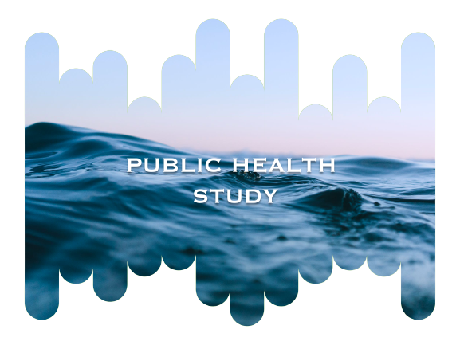

[![Contributors][contributors-shield]][contributors-url]
[![Forks][forks-shield]][forks-url]
[![Stargazers][stars-shield]][stars-url]
[![Issues][issues-shield]][issues-url]
[![MIT License][license-shield]][license-url]
[![LinkedIn][linkedin-shield]][linkedin-url]

<!-- PROJECT LOGO -->
 

  

<h1 align="center">Public Health Study</h1>

  

    You recently joined a team of researchers at the Food and Agriculture Organization of the United Nations (FAO) as a data analyst.
     
    <a href="https://github.com/CoCasali/public-health-study"><strong>Explore the docs »</strong></a>
     
  

<!-- TABLE OF CONTENTS -->

  
Table of Contents

  <ol>
    <li>
      <a href="#about-the-project">About The Project</a>
      <ul>
        <li><a href="#built-with">Built With</a></li>
      </ul>
    </li>
    <li><a href="#usage">Usage</a></li>
    <li><a href="#contact">Contact</a></li>
  </ol>

<!-- ABOUT THE PROJECT -->
## About The Project

The team leader, Marc, a health economics researcher, is particularly excited about your arrival on his team :

> The data I would particularly like to have information on are, for the year 2017:
> - the proportion of people who are undernourished ;
> - the theoretical number of people who could be fed. You should be able to calculate this from the global food availability;
> - ditto for the food availability of plant products;
> - the use of the domestic availability, in particular the part that is attributed to animal feed, the part that is lost and the part that is actually used for human food. 
> I think Julian had found a way to easily calculate these proportions.

(<a href="#readme-top">back to top</a>)

### Built With

* [![Jupyter][Jupyter.icon]][Jupyter-url]
* [![Python][Python.js]][Python-url]

(<a href="#readme-top">back to top</a>)

<!-- USAGE EXAMPLES -->
## Usage
You can find the notebook in the documentation. 

The data are in French, so the variables are also in French but the notebook is in English. 

You will find the presentation of the project in the slides. Note that the slides are in French (the presentation is made in this language). 

(<a href="#readme-top">back to top</a>)

<!-- CONTACT -->
## Contact

Corentin Casali - [@corentincasali](https://twitter.com/corentincasali)

Project Link: [https://github.com/CoCasali/public-health-study](https://github.com/CoCasali/public-health-study)

(<a href="#readme-top">back to top</a>)

<!-- MARKDOWN LINKS & IMAGES -->
<!-- https://www.markdownguide.org/basic-syntax/#reference-style-links -->
[contributors-shield]: https://img.shields.io/github/contributors/CoCasali/public-health-study.svg?style=for-the-badge
[contributors-url]: https://github.com/CoCasali/public-health-study/graphs/contributors
[forks-shield]: https://img.shields.io/github/forks/CoCasali/public-health-study.svg?style=for-the-badge
[forks-url]: https://github.com/CoCasali/public-health-study/network/members
[stars-shield]: https://img.shields.io/github/stars/CoCasali/public-health-study.svg?style=for-the-badge
[stars-url]: https://github.com/CoCasali/public-health-study/stargazers
[issues-shield]: https://img.shields.io/github/issues/CoCasali/public-health-study.svg?style=for-the-badge
[issues-url]: https://github.com/CoCasali/public-health-study/issues
[license-shield]: https://img.shields.io/github/license/CoCasali/public-health-study.svg?style=for-the-badge
[license-url]: https://github.com/CoCasali/public-health-study/blob/master/LICENSE.txt
[linkedin-shield]: https://img.shields.io/badge/-LinkedIn-black.svg?style=for-the-badge&logo=linkedin&colorB=555
[linkedin-url]: https://linkedin.com/in/corentincasali
[product-screenshot]: images/screenshot.png
[React.js]: https://img.shields.io/badge/React-20232A?style=for-the-badge&logo=react&logoColor=61DAFB
[React-url]: https://reactjs.org/
[Python.js]: https://img.shields.io/badge/Made%20with-Python-yellow?style=for-the-badge&logo=Python&logoColor=yellow
[Python-url]: https://www.python.org/
[Jupyter.icon]:https://img.shields.io/badge/Made%20with-Jupyter-orange?style=for-the-badge&logo=Jupyter
[Jupyter-url]:https://jupyter.org/try

